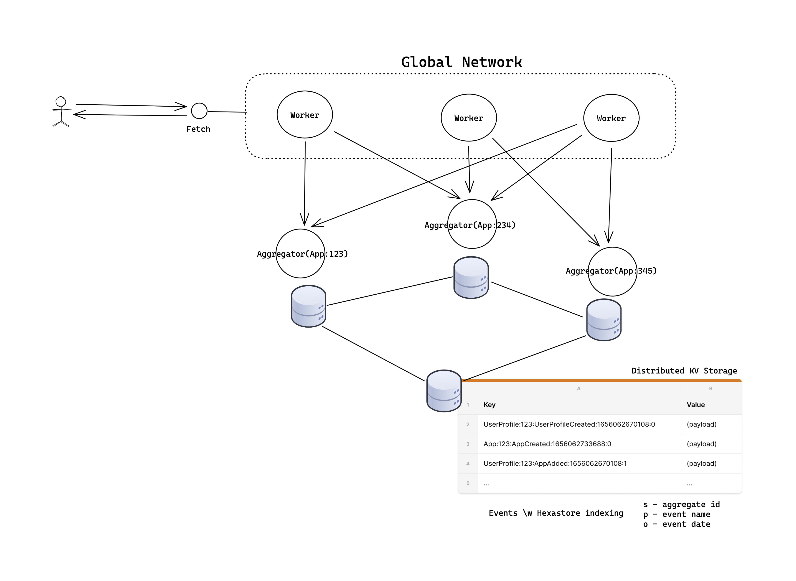

# Karrotmini Playground Adapter to Cloudflare

[Cloudflare KV](https://developers.cloudflare.com/workers/runtime-apis/kv/) & [Durable Objects](https://developers.cloudflare.com/workers/runtime-apis/durable-objects/) 백엔드로 구현된 Playground 어댑터

- In: Playground 서비스를 Cloudflare 인프라스트럭쳐에 포팅합니다.
- Out: [Fetch API](https://developer.mozilla.org/ko/docs/Web/API/Fetch_API) 기반 클라이언트를 제공합니다. Fetch 클라이언트가 존재하는 Node.js 18+, Deno, Cloudflare Workers와 같은 환경에서 인스턴스를 생성할 수 있습니다.

## Infrastructure

[See on Excalidraw](https://excalidraw.com/#json=bgse0GaQT4xgha9bR7e9z,YKRMirhUr5y3FTmOy2CF6Q)

### Components

- **Event Store**: 글로벌 분산 스토리지인 *Cloudflare KV*에 발행된 이벤트를 모두 저장합니다. 애그리게잇 ID, 이벤트 명, 이벤트 날짜 기반으로 정렬된 키를 각각 보관하여 이론적으로 [Hexastore](http://karras.rutgers.edu/hexastore.pdf) 수준 인덱싱을 가능하게 만듭니다.
- **Aggregators**: 고유한 애그리게잇 ID 마다 스폰되는 *Durable Object*를 기반으로 애그리게이터 인터페이스를 구현합니다
  - 동시에 한 군데서만 실행되는 것으로 애그리게잇 상태의 일관성을 보장합니다.
  - 일정시간동안 메모리에 상태가 보존되어 스토리지 요청 없이 빠르게 상태를 반환합니다.
  - 기본적으로 이벤트 스토어에서 상태를 복원하며 일정 주기로 [자체 스토리지](https://developers.cloudflare.com/workers/runtime-apis/durable-objects/#transactional-storage-api)에 저장한 스냅샷으로 더 빠르게 복원할 수 있습니다.
- **Event Bus**, **Projectors**: TBD
